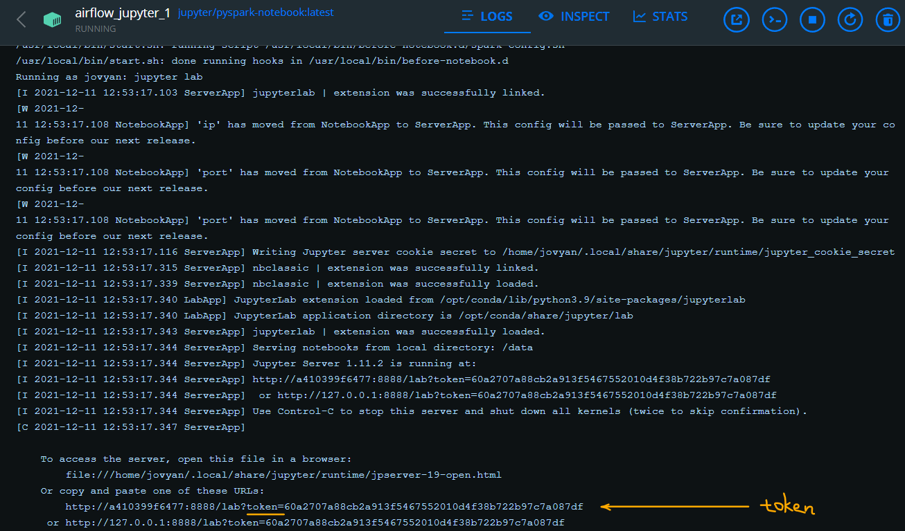
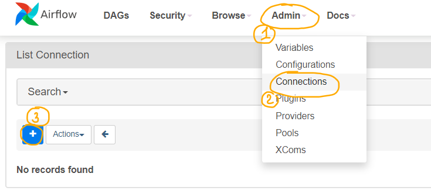

## Spark UI 
Доступен по адресу `localhost:8079`

Файлы из папки data в корневой директории проекта доступны из спарк-сервисов по пути /data  
("/" в начале означает абсолютный путь – папка /data находится в корне файловых систем контейнеров)

## JupyterLab
Доступен по адресу `localhost:8888`, токен для входа или ссылку целиком можно посмотреть в Docker GUI:  


## Airflow 
Доступен по адресу `localhost:8080`
Логин/пароль: `airflow/airflow`

# Запуск Spark-master и Spark-worker + Airflow на Windows
1. В *powershell*:
```
run
```
2. Можно остановить работу, удалить контейнеры и логи Airflow:
```
stop_hard
```
3. Либо остановить работу, оставив контейнеры и логи Airflow:
```
stop_soft
```

## Перед сборкой и стартом контейнеров в Linux
```
mkdir -p ./dags ./logs ./plugins
echo -e "AIRFLOW_UID=$(id -u)" > .env
```

# Добавление Spark-соединения в Airflow:
  
  